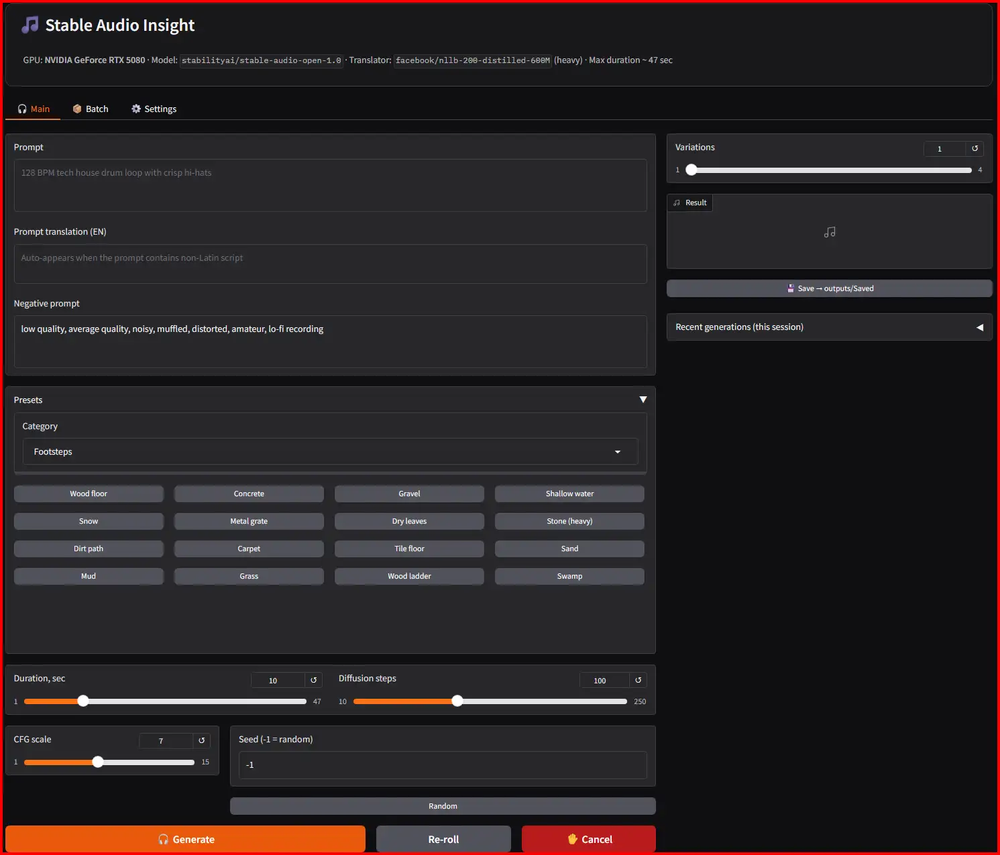
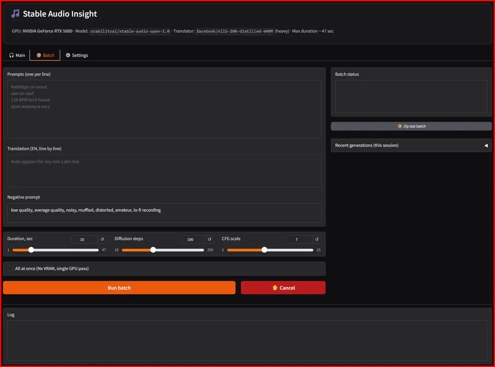
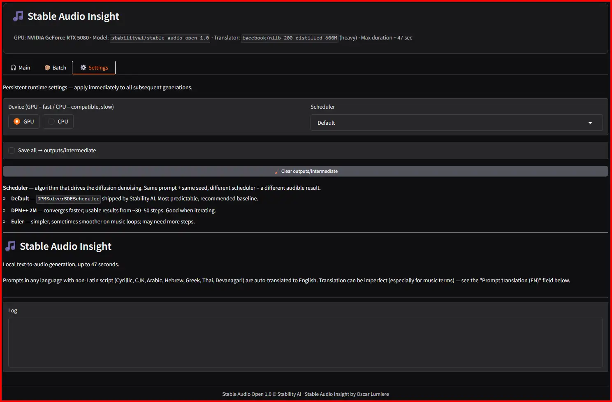

**Language:**
[English](README.md) ·
[Русский](docs/i18n/README.ru.md) ·
[中文](docs/i18n/README.zh.md) ·
[日本語](docs/i18n/README.ja.md) ·
[Español](docs/i18n/README.es.md) ·
[Français](docs/i18n/README.fr.md) ·
[Deutsch](docs/i18n/README.de.md) ·
[Português](docs/i18n/README.pt.md) ·
[한국어](docs/i18n/README.ko.md)

---

# Stable Audio Insight


<sub><i>By Oscar Lumiere</i></sub>

## Quick start
0. [Download Last Realease](https://github.com/oscarlumiere/Stable-Audio-Insight/releases)
1. Register at https://huggingface.co (skip if you already have an account)
2. Open https://huggingface.co/stabilityai/stable-audio-open-1.0 → click **Agree and access repository**
3. At https://huggingface.co/settings/tokens → **New token** → Type: Read → Create
4. Run `install.bat` → pick UI language → paste token → pick translator. Done.

Then `run.bat` opens http://127.0.0.1:7860.


Self-contained Windows app for [Stable Audio Open 1.0](https://huggingface.co/stabilityai/stable-audio-open-1.0) by Stability AI. Built for sound design, game audio, video editing and music sketches.

## What's inside

- **9-language UI** (English, Russian, Chinese, Japanese, Spanish, French, German, Portuguese, Korean) — switcher in the Gradio footer changes everything on the fly
- **Multilingual prompts** — write in Cyrillic / CJK / Arabic / Hebrew / Greek / Thai / Devanagari, gets auto-translated to English before generation. Two translator options at install: `opus-mt-mul-en` (light, ~300 MB) or `nllb-200-distilled-600M` (heavy, ~2.4 GB)
- **~217 ready presets in 15 categories** — Footsteps, Impacts, Movement, UI, Weapons, Ambience, Vehicles, Nature, Music, Cinematic, Magic, Sci-Fi, Horror, Animals, Crowd & Voice
- **Multi-variation generation** — 1 to 4 audio outputs per click (`num_waveforms_per_prompt`), scheduler picker (Default / DPM++ 2M / Euler), random seed button, re-roll button
- **Session history** — last 10 generations as collapsible mini-players
- **Batch mode** — paste many prompts (one per line), each saved straight to `outputs/Saved/`
- **ZIP export** of `outputs/Saved/` in one click
- **Game-ready output** — slugified filenames (`wood_floor_footsteps_01.wav`) with auto-incremented per-folder counters; WAV INFO chunk metadata carries title (full prompt), seed, duration, steps, cfg, sample rate, negative — read by Reaper, Audition, Ableton, ffprobe
- **GPU/CPU live toggle** plus `RunOnCPU.bat` for low-VRAM systems
- **Per-session log file** in `logs/app-YYYYMMDD-HHMMSS.log` with full tracebacks on errors
- **One-file installer** (`install.bat`) — silently sets up Python 3.11.9 inside the project folder, picks `torch+cu128` or CPU torch via `nvidia-smi` auto-detect, downloads model and translator. Truly portable: deleting the project leaves zero traces in the system
- **Update path** — `update.bat` refreshes deps and re-syncs models

<p align="center">
  <video src="https://github.com/oscarlumiere/Stable-Audio-Insight/raw/main/docs/assets/demo.webm" controls width="480"></video>
</p>

<p align="center">
  <a href="docs/assets/main.webp"></a>
  <a href="docs/assets/Batch.webp"></a>
  <a href="docs/assets/settings.webp"></a>
</p>

## Requirements

- Windows 10 / 11 (tested on Windows 11 Pro)
- Python **3.11.x** — https://www.python.org/downloads/release/python-3119/
  (during install, check **Add Python to PATH**)
- NVIDIA GPU with CUDA 12.x:
  - **Minimum**: ~4 GB VRAM (fp16, 1 variation, ≤ 20 sec, ≤ 100 steps)
  - **Recommended**: 8 GB+ VRAM for 4 variations × 47 sec at 100+ steps
  - 6 GB cards work for 1–2 variations; 4 simultaneous variations may OOM
  - For other CUDA versions change the PyTorch index in `install.bat` /
    `setup.bat` (e.g. `cu121` for CUDA 12.1)
  - No NVIDIA card → use `RunOnCPU.bat` or the **GPU/CPU** toggle in the UI
    (much slower, but works)
- **15–20 GB free disk** during install (after install: ~10–13 GB resident):
  - ~5 GB — Stable Audio Open weights
  - ~4–5 GB — Python + PyTorch CUDA + dependencies
  - 0.3–2.4 GB — translator (your choice)
  - ~5 GB — HuggingFace + pip caches + install temp files (mostly recoverable later)
- HuggingFace account + read token (only required for the initial download)

## Do I need a HuggingFace token?

**Once — only to download Stable Audio weights.** After that the app runs
offline from the local `hf-cache/`.

Stable Audio Open 1.0 is a *gated* model — Stability AI requires a registered
account and acceptance of the model license before download. So:

1. Register on https://huggingface.co (if you don't already have an account)
2. Open the model page and **accept the license**:
   https://huggingface.co/stabilityai/stable-audio-open-1.0
   (click **Agree and access repository** — without this the download
   returns 403)
3. Create a read token: https://huggingface.co/settings/tokens
4. `install.bat` will ask you to paste the token at the right moment

The translator models (`opus-mt-mul-en` and `nllb-200-distilled-600M`) are
**not** gated and need no token.

## Install (recommended path)

A single file does everything in one go:

```
install.bat
```

What it does:

1. Picks the prompts language (1–9: English, Russian, Chinese, Japanese,
   Spanish, French, German, Portuguese, Korean)
2. Verifies that Python 3.11 is on PATH (`py -3.11`)
3. Creates `.venv` and upgrades pip / wheel
4. Installs PyTorch (CUDA 12.8) and the rest of `requirements.txt`
5. Asks for the HF token (or skips if you're already logged in)
6. **Asks which translator to install:**
   - **1. LIGHT** — `Helsinki-NLP/opus-mt-mul-en`
     - ~300 MB, fast, Apache 2.0 (commercial use OK)
     - Medium quality, sometimes mistranslates music terms
   - **2. HEAVY** — `facebook/nllb-200-distilled-600M`
     - ~2.4 GB, slower, CC-BY-NC 4.0 (**non-commercial only**)
     - Higher quality, recommended for non-English
7. Saves the choice to `hf-cache/translator.cfg`
8. Downloads Stable Audio (~5 GB) and the chosen translator into `hf-cache/`

## Run

```
run.bat
```

A browser tab opens at http://127.0.0.1:7860.

## Switch the translator after install

Quickest path:

1. Open `hf-cache/translator.cfg` and change to `light` or `heavy`
2. Run `download.bat` — it will fetch the chosen one if it's not in cache
3. `run.bat`

Or delete `hf-cache/translator.cfg` and run `install.bat` again — it will ask anew and
will not re-download dependencies or Stable Audio (already in cache).

## Step-by-step install (if something goes wrong)

`install.bat` is a wrapper around four smaller scripts; each can be run alone:

| Script | What it does |
| --- | --- |
| `setup.bat` | Creates `.venv` and installs dependencies |
| `login.bat` | HuggingFace authentication (`hf auth login`) |
| `download.bat` | Downloads Stable Audio + the translator from `hf-cache/translator.cfg` |
| `run.bat` | Launches the Gradio web UI |

## Project layout

```
.
├── app.py              # Gradio UI + generation
├── translator.py       # Translator module (light / heavy)
├── download_model.py   # Model downloads from HuggingFace
├── requirements.txt    # Python dependencies
├── install.bat         # Single-file installer (multilingual)
├── setup.bat           # Just venv + dependencies
├── login.bat           # Just HF auth
├── download.bat        # Just downloads
├── run.bat             # Launch the web UI
├── hf-cache/translator.cfg  # light / heavy (created by install.bat)
├── README.md           # main docs (English)
├── docs/i18n/          # localized README in 8 other languages
├── LICENSE             # MIT — for the source code in this repo
├── NOTICE.md           # Licenses of the models used
├── hf-cache/           # Local HF cache (NOT in git)
└── outputs/            # Saved audio (NOT in git)
    ├── intermediate/   # When the "Save all" checkbox is on
    └── Saved/          # When you press the "Save" button
```

## Environment variables

You can override these before running `run.bat`:

| Variable | Default | Purpose |
| --- | --- | --- |
| `HOST` | `127.0.0.1` | Gradio host |
| `PORT` | `7860` | Gradio port |
| `SHARE` | `0` | `1` = create a public gradio.live URL |
| `STABLE_AUDIO_MODEL` | `stabilityai/stable-audio-open-1.0` | Override the model |

## Licenses

This **source code** is MIT (see `LICENSE`).

The **models** each have their own licenses (see `NOTICE.md` for full text):

| Model | License | Commercial use |
| --- | --- | --- |
| Stable Audio Open 1.0 | Stability AI Community | Up to $1M annual revenue: yes; above: Enterprise license required |
| opus-mt-mul-en (light) | Apache 2.0 | Yes |
| NLLB-200-distilled-600M (heavy) | CC-BY-NC 4.0 | **No, non-commercial only** |

If you intend to use this commercially, pick the **light** translator at install.

## Tested on

- Windows 11 Pro
- Python 3.11.9
- NVIDIA RTX 5080 (16 GB VRAM)
- CUDA 12.8
- PyTorch 2.11.0+cu128

## Credits
- **[Stable Audio Open 1.0](https://huggingface.co/stabilityai/stable-audio-open-1.0)** — Stability AI
- **[opus-mt-mul-en](https://huggingface.co/Helsinki-NLP/opus-mt-mul-en)** — Helsinki-NLP / Tatoeba Translation Challenge
- **[NLLB-200](https://huggingface.co/facebook/nllb-200-distilled-600M)** — Meta AI / FAIR
- **[Gradio](https://github.com/gradio-app/gradio)**, **[diffusers](https://github.com/huggingface/diffusers)**, **[transformers](https://github.com/huggingface/transformers)**, **[accelerate](https://github.com/huggingface/accelerate)** — HuggingFace
- **Wrapper development** — [Oscar Lumiere](https://www.io-oscar.com/)
- **Assistance** — [Claude Code](https://www.anthropic.com/claude-code) (Anthropic)
